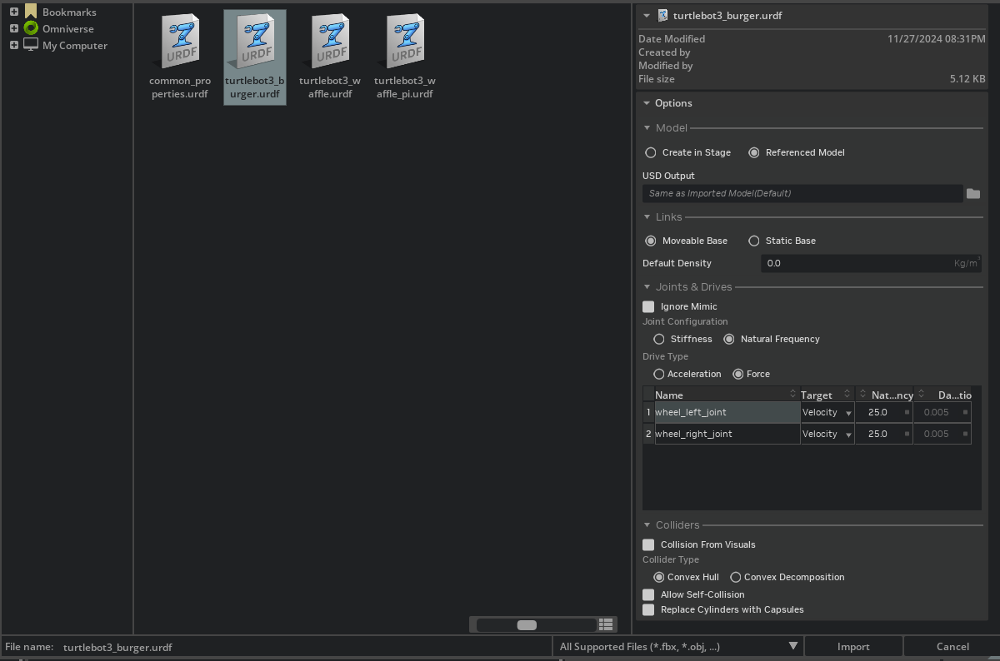

# Isaac Sim

Isaac Sim comes with a collection of workflows for importing and tuning mechanical systems designed in the format [Unified Robotics Description Format (URDF)](https://docs.isaacsim.omniverse.nvidia.com/latest/robot_setup/import_urdf.html#isaac-sim-app-tutorial-advanced-import-urdf). This is made possible through the use of the [Universal Scene Description (USD)](https://openusd.org/release/index.html), an easily extensible, open source 3D scene description API that serves as the unifying data interchange format at the heart of Isaac Sim.

[https://docs.google.com/document/d/1ynF6i-0MLC-Yyzx662YdkWfJjKOwsB_aQVRHUTdU59w/edit?tab=t.0#heading=h.kbjwbwkl4jp0](https://docs.google.com/document/d/1ynF6i-0MLC-Yyzx662YdkWfJjKOwsB_aQVRHUTdU59w/edit?tab=t.0#heading=h.kbjwbwkl4jp0)

## Quickstart with Isaac Sim

- Launch Isaac Sim by running the [App Selector](https://docs.isaacsim.omniverse.nvidia.com/latest/installation/install_workstation.html#isaac-sim-install-workstation) from installation root folder.
cd ~/isaacsim
./isaac-sim.selector.sh
- Add a Ground Plane - Create>Physics>Ground Plane
- Add a Light Source - Create>Lights>Distant Light
- Add a Visual Cube - A “visual” cube is a cube with no physics properties attached. No mass, no collision. This cube will not fall under gravity or collide with other objects. You can press Play button to see the cube does not do anything when simulation is running. Go to the top Menu Bar and Create>Shapes>Cube.
- Add Physics and Collision Properties - Physics and Collision properties can be added separately, so you can have an object that collides with other objects but does not fall under gravity, or falls under gravity but does not collide with other objects. But in many cases, they are added together.
    1. To add physics and collision properties to the cube, first find the object (“/World/Cube”) on the stage tree and highlight it.
    2. Then go to the **Property** panel on the bottom right of the Workspace. In the **Property** panel, click on the **Add** button and select **Physics** on the dropdown menu. This will show a list of properties that can be added to the object.
    3. Select **Rigid Body with Colliders Preset** to add both phyiscs and collision meshes to the object.
    4. Press the **Play** button to see the cube fall under gravity and collide with the ground plane.
    

## Quickstart with a Robot

- Add a robot to stage - Start with a new stage (File>New Stage). Add robot to the scene by going to the top Menu Bar and Create>Robot>Franka Emika Panda Arm
- Examine the robot - Use Physics Inspector to examine the robot’s joint properties. Go to Tools > Physics > Physics Inspector. In the newly appeared window on the left, select Franka to inspect. Click on the hamburger icon on the top right to see options such as joint stiffness and damping.
- Control the robot - The GUI-based robot controllers are inside the Omniverse visual programming tool, OmniGraphs. To move the robot, you need to change the values in the “JointCommandArray” node inside the *Position_Controller* graph. To visualize the generated graph, open an graph editor window: Window > Graph Editors > Action Graph.
    1. Open the graph generator by going to Tools > Robotics > Omnigraph Controllers > Joint Position.
    2. In the newly appeared “Articulation Position Controller Inputs” popup window, click *Add* for the “Robot Prim” field, select Franka as the Target.

## Workflows

There are three main workflows when developing in Isaac Sim: GUI, extensions, and standalone Python. 

## Assets and Robots

Isaac Sim provides a variety of assets and robots to help you build your virtual world. Some are made specifically for Isaac Sim and others are made for other NVIDIA Omniverse-based applications. The ones that are available to you by default are all located in the **Window > Browser** tab. (The [Omniverse Activity UI](https://docs.omniverse.nvidia.com/kit/docs/omni.activity.ui) allows you to monitor the progress and activities when assets are being loaded.)

- Nova Carter
    
    Nova Carter is a complete robotics development platform that accelerates the development and deployment of next-generation Autonomous Mobile Robots (AMRs).
    
    Nova Carter is being used as a reference platform for both Isaac AMR and Isaac ROS software, enabling real-world and simulation-based development.
    
    - The Nova Carter assets can be found on nucleus after NVIDIA Isaac Sim is installed, the Nova Carter assets are in the `/Isaac/Robots/Carter/` folder, the ROS and ROS2 assets are in the `/Isaac/Samples` folder, and the sample environments are in the `/Isaac/Sampls/ROS2/Scenarios/` folder.
    - `/Isaac/Robots/Carter/nova_carter.usd`, the Nova Carter robot with no sensors attached.
    - `/Isaac/Robots/Carter/nova_carter_sensors.usd`, the Nova Carter robot with sensors attached.
    - `/Isaac/Samples/ROS2/Robots/Nova_Carter_ROS.usd`, the Nova Carter robot with sensors attached and ROS2 action graph enabled.
    - `/Isaac/Robots/Carter/nova_dev_kit_sensors.usd`, the Nova Dev Kit with sensors attached.
    - `/Isaac/Samples/ROS2/Robots/Nova_Dev_Kit_ROS.usd`, the Nova Dev Kit with sensors attached and ROS2 action graph enabled.
    - `/Isaac/Samples/ROS2/Robots/Nova_Dev_Kit_On_Robot_ROS.usd`, the Nova Dev Kit ROS model attached to a Nova Carter base.
    - Ros2 Sample Space - First activate **Windows** > **Examples** > **Robotics Examples** which will open the `Robotics Examples` tab. The sample scene can be loaded after [enabling the ROS2 Bridge Extension](https://docs.isaacsim.omniverse.nvidia.com/latest/installation/install_ros.html#isaac-sim-app-enable-ros) by clicking *Robotics Examples > ROS2 > Isaac ROS > Sample Scene*.
    - The navigation scene can be loaded after [enabling the ROS2 Bridge Extension](https://docs.isaacsim.omniverse.nvidia.com/latest/installation/install_ros.html#isaac-sim-app-enable-ros) by clicking *Robotics Examples > ROS2 > Navigation > Carter Navigation*.
- Environmental Assets
    
    **Simple Grid** - This simple environment contains a flat ground and sides with a grid texture. To create a flat grid, search `default_environment.usd` in the asset browser or using the create menu: *Create>Environments>Flat Grid.* For curved, search `gridroom_curved.usd` in the asset browser > Curved Grid.
    
    **Simple Room** - A simple room containing a table. search `simple_room.usd` in the asset browser or using the create menu: *Create>Environments>Simple Room*
    
    **Warehouse** - A warehouse environment with shelving and objects that can be placed on them. search `warehouse_multiple_shelves.usd` in the asset browser.
    A small warehouse with multiple shelves.                                                               search `full_warehouse.usd` in the asset browser.
    A full-sized warehouse with shelves, obstacles on the floors, and forklifts.
    
    **Hospital** - A hospital environment, with multiple rooms and spaces. search `hospital.usd` in the asset browser.
    
    **Office** - An Office Environment, with multiple rooms and an open plan floor. search `office.usd` in the asset browser.
    
    **Jetracer Track** - A jetracer track outlined on the ground plane. search `jetracer_track_solid.usd` in the asset browser.
    
    **Small Warehouse Digital Twin** - A digital twin of a small warehouse, it can be created using search `small_warehouse_digital_twin.usd` in the asset browser.
    

## **Isaac Sim with ROS 2 workflow**

The Isaac Sim to ROS 2 workflow is similar to workflows executed with other robot simulators such as [**Gazebo**](https://gazebosim.org/home). At a high level, it starts with bringing your robot model into a prebuilt Isaac Sim environment. The next step entails adding sensors to the robot, followed by connecting up the relevant components to the ROS 2 action graph and simulating the robot by controlling it through your ROS 2 packages.

Enabling the ROS 2 Bridge gives access to [rclpy](https://github.com/ros2/rclpy), the ROS 2 client library for Python. This makes it possible to write your custom ROS 2 code containing nodes, services and actions which can directly access and modify data from the scene and the simulated robot when scripting in Python.

## Instanceable Assets

Reinforcement learning often requires training in large simulation scenes with multiple clones of the same robots. As we add more and more robots into the simulation environment, the memory consumption also increases for each additional set of robot and mesh assets added. To reduce memory consumption, we can take advantage of USD’s [Scenegraph Instancing](https://graphics.pixar.com/usd/dev/api/_usd__page__scenegraph_instancing.html) functionality to mark common meshes shared by different copies of the same robots as instanceable.

USD prohibits modifying properties of prims on descendants of instanced prims. Therefore, we generally only perform instancing on mesh prims for robot assets, since properties on meshes will not differ across different environments during simulation.  To mark any mesh or primitive geometry prim in the asset as instanceable, the mesh prim requires a parent Xform prim to be present, which will be used to add a reference to a master USD file containing definition of the mesh prim.

To use the Instanceable option in the importers, first check the Create Instanceable Asset option. Then, specify a file path to indicate the location for saving the mesh data in the Instanceable USD Path textbox. This will default to ./instanceable_meshes.usd, which will generate a file instanceable_meshes.usd that is saved to the current directory.

Once the asset is imported with these options enabled, you will see the robot definition in the stage - we will refer to this stage as the master stage. If we expand the robot hierarchy in the Stage, we will notice that the parent prims that have mesh descendants have been marked as Instanceable and they reference a prim in our Instanceable USD Path USD file. We are also no longer able to modify attributes of descendant meshes.

To add our instanced asset into a new stage, we will simply need to add our master USD file.

## URDF Import: Turtlebot

- Clone the Turtlebot3’s description package if you haven’t done so already.
    
    > git clone -b <distro>-devel https://github.com/ROBOTIS-GIT/turtlebot3.git turtlebot3
    > 
- Locate the URDF file for Turtlebot3 Burger in `turtlebot3/turtlebot3_description/urdf/turtlebot3_burger.urdf`.
1. Open the environment by going to the *Isaac Sim Assets* tab below the viewport, and find *Environments/Simple_Room/simple_room*. If you do not want to use the provided environment, just make sure there is a *GroundPlane* and a *PhysicsScene* to your environment. Both can be found in *Create > Physics*. You may also need some lighting, play with the various types of lighting in *Create > Light* to get the desired effect.
2. On a new stage, drag the *simple_room.usd* onto the stage, and place it at the origin by zero out all the *Translate* components in the Transform Property. You many need to zoom in a bit to see the table inside the room.
3. Click **File > Import**, then locate the URDF file and select it.
4. In the prompt window, select **Referenced Model**. Inside the **Links** section, set to *Moveable Base*. Since this is a mobile robot, change targets of **wheel_left_joint** and **wheel_right_joint** to *Velocity* under the *Joints & Drives* section so that wheels can be properly driven later.
5. The configuration of the robot should match the following:
    
    
    
6. Once the asset is imported into Omniverse Kit, a copy of the .usd version of the asset will be automatically saved. You can specify the folder you wish to save the asset in *USD Output* if it’s different than the folder that the .urdf file is located in. A folder name matching the *.urdf* file will be created in the specified directory, and the *.usd* file will be inside the newly created folder.
7. When the Turtlebot is first imported, it will be on the table. Place it just above the floor of the room using the gizmo.
8. Press **Play** and you should see the Turtlebot fall onto the floor.

## Standalone Example Scripts

1. Time Stepping - ./python.sh standalone_examples/api/isaacsim.core.api/time_stepping.py
2. Load USD Stage - ./python.sh standalone_examples/api/isaacsim.simulation_app/load_stage.py --usd_path /Isaac/Environments/Simple_Room/simple_room.usd
3. Import URDF - ./python.sh standalone_examples/api/isaacsim.asset.importer.urdf/urdf_import.py
4. Change Resolution - ./python.sh standalone_examples/api/isaacsim.simulation_app/change_resolution.py
5. Convert Assets to USD - ./python.sh standalone_examples/api/omni.kit.asset_converter/asset_usd_converter.py --folders standalone_examples/data/cube standalone_examples/data/torus
6. Livestream - ./python.sh standalone_examples/api/isaacsim.simulation_app/livestream.py

## How to import URDF in Gazebo?

1. Using `spawn_model` script (ROS-based) -

- Locate the script: The `spawn_model` script is located within the `gazebo_ros` package.
- Command: Use the following command in your terminal, replacing placeholders with your actual URDF file path and desired model name:

    `rosrun gazebo_ros spawn_model -file <PATH_TO_YOUR_URDF_FILE> -urdf -x <X_POSITION> -y <Y_POSITION> -z <Z_POSITION> -model <MODEL_NAME>`

- `x`, `y`, `z`: Specify the position in the world where the model should be spawned.
- `model`: Specifies the name of the model in Gazebo.

Example:

    `rosrun gazebo_ros spawn_model -file `rospack find MYROBOT_description`/urdf/MYROBOT.urdf -urdf -x 0 -y 0 -z 1 -model MYROBOT`

**2.** Including URDF in a Gazebo world file -

- Add to Gazebo model database: You need to add the directory containing your URDF file to the `GAZEBO_MODEL_PATH` environment variable.
- Create a world file: Create a new world file (e.g., `my_world.sdf`) and add the URDF model to it.

- Launch Gazebo: Launch Gazebo with your world file: `gazebo --verbose my_world.sdf`.